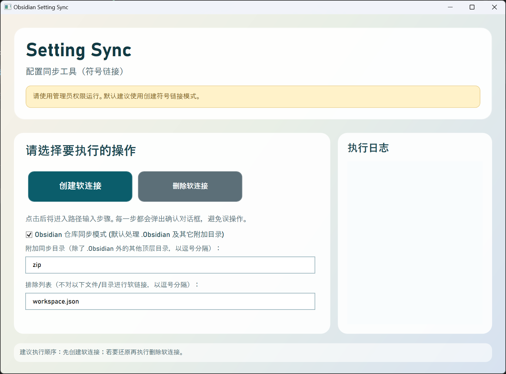

# Obsidian Setting Sync

用于 Obsidian 多仓库配置同步（符号链接方式），同时也支持任意本地文件夹的完全同步。

注意事项：
**1. 请以管理员模式运行！**
**2. 运行环境需要安装 .NET 10.0。**

## 当前版本

- 已重构为 C# WPF 图形界面应用，支持 .NET 10.0。
- 首页提供两个主要按钮：`创建软连接`、`删除软连接`。
- **Obsidian 仓库同步模式（默认开启）**：
  - 限制仅选择包含 `.Obsidian` 文件夹的仓库根目录。
  - 默认处理根目录下的 `.Obsidian` 文件夹，可通过输入框自定义添加其他需要同步的文件夹（如附加的 `zip`）。同时支持通过**排除列表**指定不进行分享的本地配置文件。
- **通用同步模式（取消勾选 Obsidian 模式）**：
  - 可以选择任意路径的源和目标文件夹。
  - 自动处理选定文件夹下的**所有**文件和子文件夹（不再限制默认的文件名列表）。
- 每一步关键按钮点击都会弹出确认对话框，防止误操作。

## 使用步骤

1. 以管理员身份启动程序。
2. 在首页选择 `创建软连接` 或 `删除软连接`。
3. 在下一页选择：
  - 目标路径（Obsidian 模式下选择仓库根目录）
  - 源路径（Obsidian 模式下选择仓库根目录）
4. 根据需求勾选或取消勾选 `Obsidian 仓库同步模式`。
5. 点击执行按钮并在弹窗中确认。
6. 在右侧日志区查看每一项处理结果。

